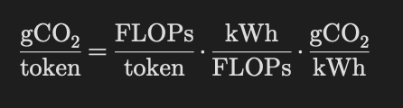

# Leaf

</svg>

### 🍀 Try our product [here](https://be-green.wiki/)!

## Overview

Leaf is a powerful, sustainability-focused LLM chat application and middleware that reduces the environmental impact of AI usage. Built on Next.js, and using a combination of model rightsizing, difficulty prediction, parallel subtasking, and clean energy forecasts, Leaf minimizes token usage and compute waste.

Every response reports the carbon cost of the computation alongside a user's CO₂ savings, demonstrating the benefit of model rightsizing and subtask generation against naively routing requests through flagship models.

## Screenshots

## Features

### Environmental Middleware
 
- **Model Rightsizing**: Leaf intelligently selects the most appropriate model for each task, eliminating waste caused by overpowered models handling simple requests.
- **Parallel Subtasking**: Complex tasks are decomposed into smaller subtasks and presented to the user for confirmation before execution. This prevents costly AI hallucinations and gives clients visibility and control over their carbon usage.
- **Green Datacenter Selection**: Using IP-based locations, live grid carbon intensity, and energy forecasts, Leaf routes requests to the most environmentally friendly datacenter available, even allowing clients to route their traffic to greener areas of the globe.
 
### Search Integration
 
- **Google Search** (via Serper) for fast factual lookups, avoiding the waste of LLM-driven fetch tools that retrieve entire pages unnecessarily.
- **Exa** for deep research and ranked web results, built to minimize costly fetch failiures and optimized for web search speed.
 

 
### Carbon Tracking
 
- Renders per-message carbon cost in µg / mg / g CO₂ using physics-grounded FLOPs accounting and real-time grid-carbon intensity information
- Calculates Savings vs. naive baseline, giving clients transparent visibility into the algorithm's process
- Displays subtask organization and carbon totals in real time through the sidebar, and creates a client-specific full statistics dashboard

Carbon Tracking is determined through a unit analysis of real-time electric grid statistics and model parameter size. By mapping grid-carbon intensity to hardware efficiency and model compute rates, we can trace the consumption of electricity from token to CO₂ production. Our equations and unit analysis can be found below.

Carbon-Token Ratio (grams of CO2 per token) = 
Model Compute Coefficient (Floating Point Operations per token) × 
Hardware Efficiency coefficient (kiloWatt hours per Floating Point Operation) × 
Grid-Carbon Intensity (grams of CO2 per kiloWatt hour)

### Lava API Gateway
 
We extend the [Lava](https://www.lava.so) API to offer hundreds of LLM providers and datacenter locations to clients anywhere in the world.

## Tech Stack

| Layer | Technology |
|---|---|
| Framework | Next.js 15 (App Router) |
| Auth | NextAuth.js v4 + MongoDB Adapter |
| Database | MongoDB + Mongoose |
| LLM Gateway | [Lava API](https://lava.so) |
| Globe | Three.js / Globe.gl |
| Charts | Recharts + shadcn/ui |
| Styling | Tailwind CSS v4 |

## How It Works

