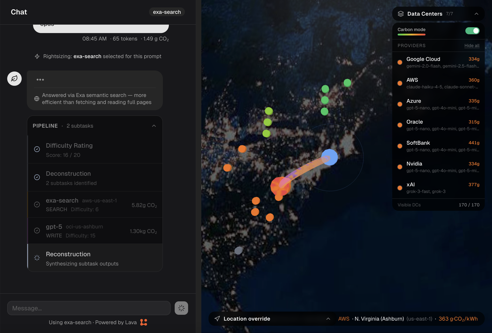
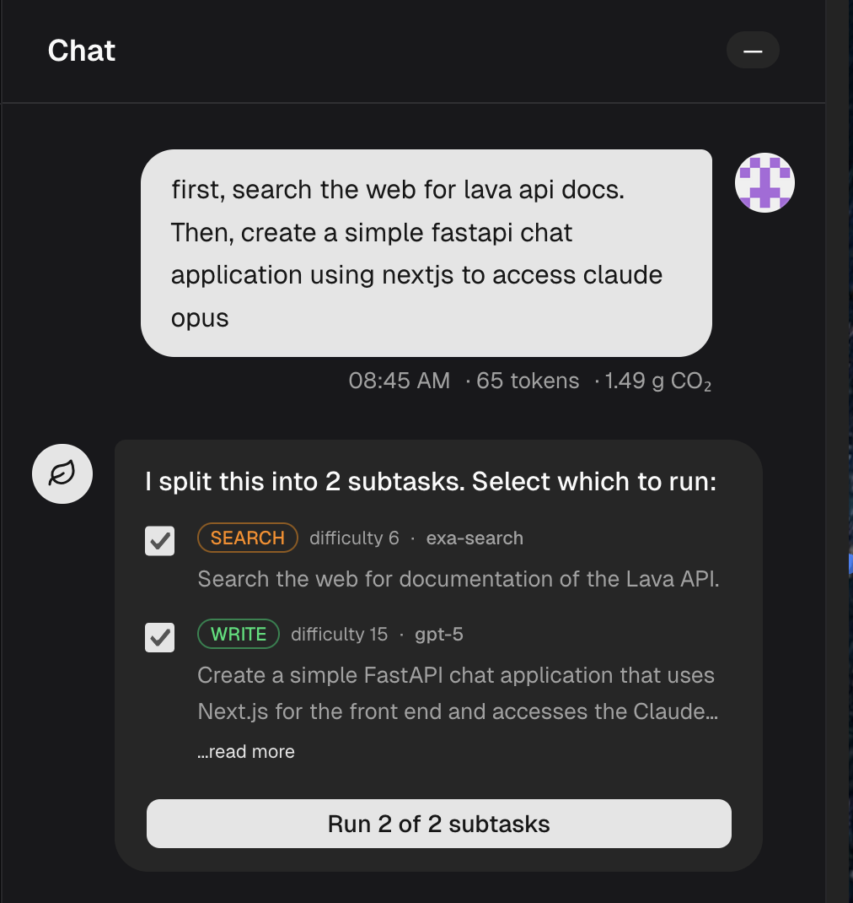
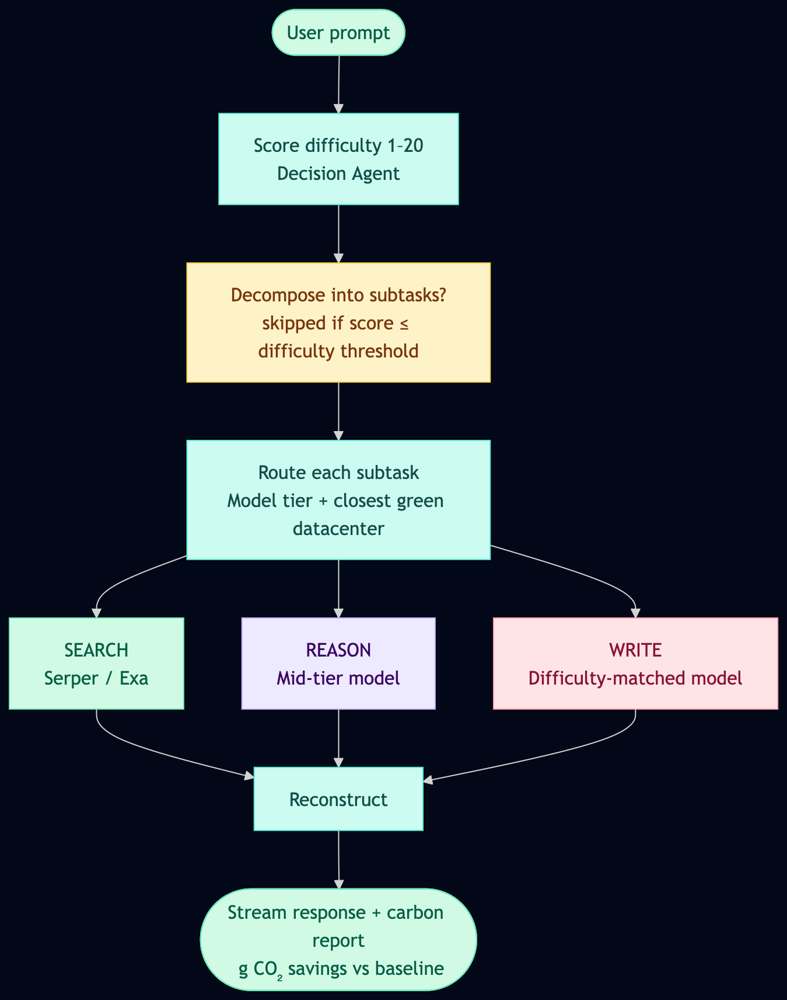

# Leaf

</svg>

### 🍀 Try it [here](https://be-green.wiki/)!

## Overview

Leaf is a powerful LLM middleware built on Next.js that reduces the environmental impact of AI chat. Using a combination of model rightsizing, difficulty prediction, parallel subtasking, and clean energy forecasts, Leaf minimizes token usage and compute waste.

Every response reports the carbon cost of the computation alongside how much CO₂ was saved compared to naively routing the same request through a flagship model.

## Screenshots

## Features

### Environmental Middleware
 
- **Model Rightsizing**: Leaf intelligently selects the most appropriate model for each task, eliminating waste caused by overpowered models handling simple requests.
- **Parallel Subtasking**: Complex tasks are decomposed into smaller subtasks and presented to the user for confirmation before execution. This prevents costly, hallucinated AI responses that don't contribute to your answer.
- **Green Datacenter Selection**: Using your location, live grid carbon intensity, and energy forecasts, Leaf routes requests to the most environmentally friendly datacenter available.
 
### Search Integration
 
- **Google Search** (via Serper) for fast factual lookups, avoiding the waste of LLM-driven fetch tools that retrieve entire pages unnecessarily.
- **Exa** for deep research and ranked web results.
 
### Lava API Gateway
 
We use [Lava](https://www.lava.so) to offer hundreds of LLM providers and datacenter locations.
 
### Carbon Tracking
 
- Per-message carbon cost in µg / mg / g CO₂ using physics-grounded FLOPs accounting
- Savings vs. naive baseline (running the same tokens through the heaviest available model)
- Running totals in the sidebar and a full statistics dashboard

## Tech Stack

| Layer | Technology |
|---|---|
| Framework | Next.js 15 (App Router) |
| Auth | NextAuth.js v4 + MongoDB Adapter |
| Database | MongoDB + Mongoose |
| LLM Gateway | [Lava API](https://lava.so) |
| Globe | Three.js / Globe.gl |
| Charts | Recharts + shadcn/ui |
| Styling | Tailwind CSS v4 |

## How It Works

